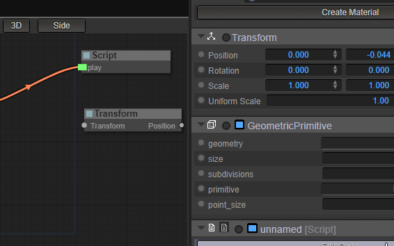

# Graphs #

Besides using Scripts to control behaviour and rendering passes, you can also use Graphs.

A Graph contains nodes representing elements of your scene, and wires to transfer actions or data between the nodes.

This way you can set up simple behaviours without the need of using code and in a more transparent way.


You can also use graphs to control the rendering postprocessing effects using the FXGraphComponent.


## Creating a Graph

To create a graph you need to add a ```GraphComponent``` to a node (or if it is for postprocessing, use ```FXGraphComponent```).

If you are using the editor, there is already a button at the bottom to create a Graph.

## Graph modes

Graphs are like functions that are executed when some specific event happens. By default Graphs are associated with the update event, but you can change it if you do not want your graphs to be in execution all the time.

To change the mode you must set the ```on_event``` property. Here are the possible values:

- start: after loading everything, when the application starts.
- update: once every update (60 times per second usually), and only if the scene is running.
- render: after rendering the scene
- beforeRenderScene: before rendering the scene
- trigger: when the component gets triggered (this feature is not finished yet).

## Adding nodes to the graph

To add a node to the graph you can use the editor, open the graph and drag the component in the graph canvas (you must drag the icon in the title of the component).




Or you can right click in the graph canvas and add any of the nodes in the list.

## Using events

Graph nodes allow to define events dispatched by the graph nodes, and actions that we could connect to those events.

This way by connection events to actions we can make a event-oriented graph, instead of the regular data flow graph.

## Creating your own component events/actions

To create actions that could be called from events triggered by graph nodes, you must define them manually in your component.

First by creating the function ```getActions``` that returns an array with all the actions that this node could perform.

```js
MyComponent.prototype.getActions = function()
{
  return ["Play","Stop"];
}
```

Now they will appear as a possible output of your graph node in the context menu.

Then we must define the function that will be triggered when the action is executed.

```
MyComponent.prototype.onAction = function( action, params )
{
  console.log( action, params);
}
```

If no ```onAction``` method is found in the component but the component has a method with the same name as the action, then that method will be called.

To trigger events from our component, just call the trigger function from LEvent:

```js
MyComponent.prototype.onAction = function( action, params )
{
  setTimeout(function(){
  	LEvent.trigger( component, "finished" );
  },1000);
}
```

## Documentation

To know more about graphs check [LiteGraph.js](https://github.com/jagenjo/litegraph.js)
